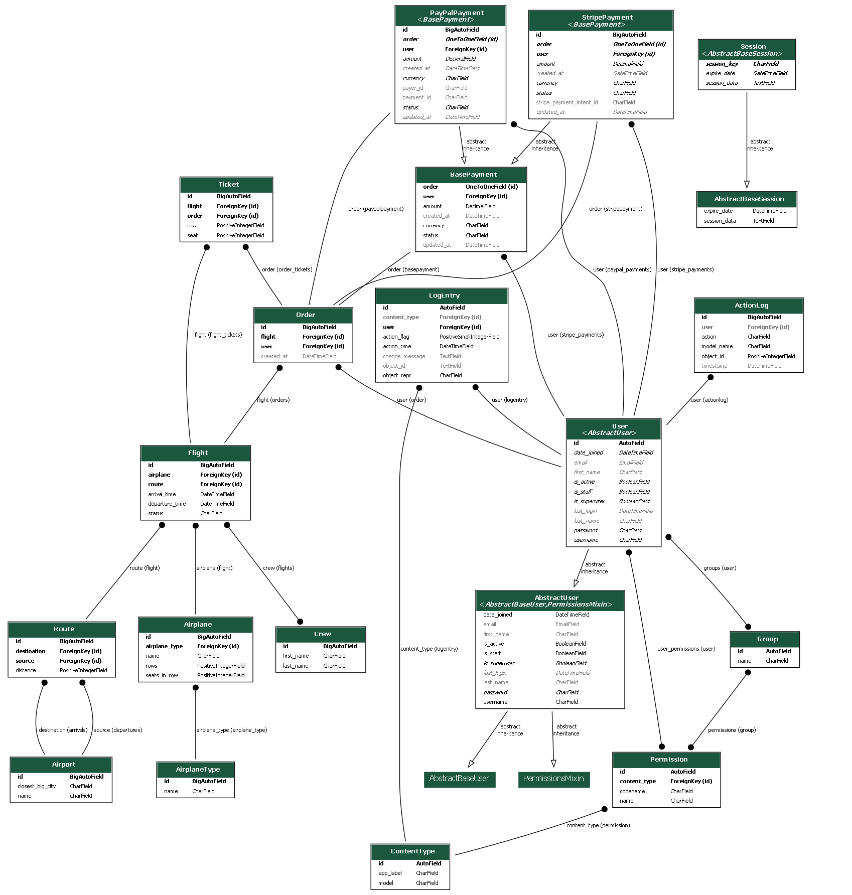
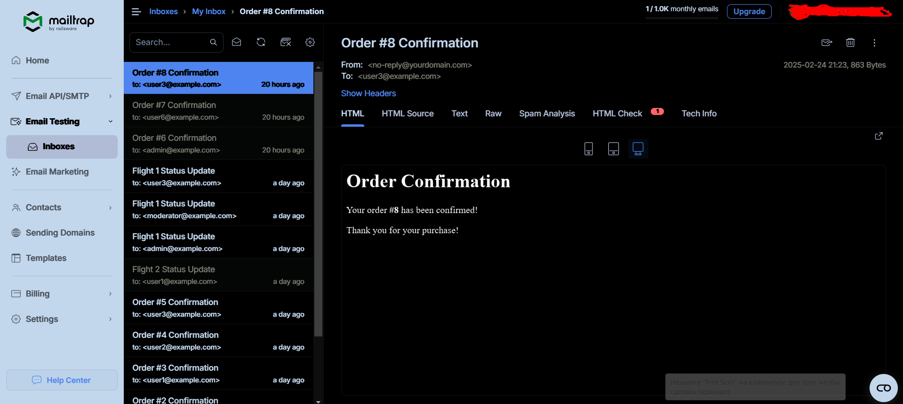

# Airport Project

**Airport** is a system for managing airports, flights, ticket orders, and related operations, developed using Django
and Django REST Framework (DRF).

## Main Features

1. **Airport and Route Management**: Add and edit information about airports, routes between them, and flights.
2. **Flight and Airplane Management**: Information about flights, airplanes, and crews.
3. **Orders and Tickets**: Users can create flight orders and receive corresponding tickets.
4. **Integration with Payment Systems**: Support for Stripe and PayPal payment systems (in test mode).
5. **JWT Authentication and Access Control**: Use of JWT for user authentication and access management.

## Technology Stack

- **Backend**: Django, Django REST Framework
- **Database**: PostgreSQL 17 (or another compatible database)
- **Authentication**: JWT (JSON Web Tokens)
- **Payment Systems**: Stripe, PayPal (in test mode)
- **Testing**: Django tests, JWT tokens for testing protected endpoints
- **Other**: Docker, Docker Compose, Python 3.x

## Project structure



## Installation and Setup

1. **Clone the repository**:

```bash
   git clone https://github.com/MindDevastation/py-airplane-portfolio-project.git
   cd py-airplane-portfolio-project
```

2. **Create and activate a virtual environment:**

For Linux/macOS:

```bash
   python3 -m venv venv
   source venv/bin/activate
```

Windows:

```bash
   python3 -m venv venv
   venv\Scripts\activate
```

3. **Install dependencies:**

```bash
   pip install -r requirements.txt
```

4. **Navigate to the data folder:**

```bash
   cd src
```

5. **Create and apply migrations:**

```bash
   python manage.py makemigrations
   python manage.py migrate
```

6. **Load the data:**

```bash
   python manage.py loaddata airport_db_data.json
```

7. **You can also create a superuser:**

```bash
   python manage.py createsuperuser
```

8. **Run the server:**

```bash
   python manage.py runserver
```

The project will now be available at http://127.0.0.1:8000/.

## Testing

Use the following commands for testing:

1. **Run tests:**

```bash
   python manage.py test
```

2. **Run tests for specific applications, for example, for the station app:**

```bash
   python manage.py test station
```

## Test Users

1. **Regular User:**

**Username:** user1
**Password:** test123

2. **Superuser:**

**Username:** admin_user
**Password:** test123

3. **Moderator**

**Username:** moderator_user
**Password:** test123

## Project Structure

The project has the following directory structure:

<pre>py-airplane-portfolio-project/
│
├── src/                         # Main project directory
│   ├── airport/                 # Django core project
│   │   ├── __init__.py
│   │   ├── settings.py          # Project configurations
│   │   ├── urls.py              # Main routes
│   │   ├── wsgi.py              # Settings for WSGI
│   │   ├── asgi.py              # Настройки для ASGI
│   │   ├── pagination.py        # Pagination customization
│   │   ├── permissions.py       # Customization of access rights
│   │   └── ...                  # Other project files
│   │
│   ├── station/                 # Application for managing airports, flights and bookings
│   │   ├── __init__.py
│   │   ├── models.py            # Data models (Airport, Route, Flight, etc.)
│   │   ├── views.py             # Views for working with APIs
│   │   ├── serializers.py       # Serializers for models
│   │   ├── signals.py           # Signals for sending email notifications
│   │   ├── urls.py              # Routes for the application
│   │   ├── tests/               # Application tests
│   │   │   ├── test_api.py      # Tests for API
│   │   │   ├── test_signals.py  # Tests for signals
│   │   │   ├── test_exports.py  # Tests for data export
│   │   └── ...                  # Other application files
│   │
│   ├── payment/                 # Application for working with payments
│   │   ├── __init__.py
│   │   ├── models.py            # Data models for payments
│   │   ├── views.py             # Types for working with payments
│   │   ├── serializers.py       # Serializers for payment models
│   │   ├── urls.py              # Routes for the application
│   │   ├── tests/               # Application tests
│   │   │   └── test_payment_view.py  # Tests for payments
│   │   └── ...                  # Other application files
│   │
│   ├── manage.py                # Project Management Master File
│   ├── templates/               # Email notification templates
│   │   ├── flight_reminder_email.html
│   │   ├── flight_status_update_email.html
│   │   ├── order_confirmation_email.html
│   │   └── ...                  # Other templates
│   ├── airport_db_data.json     # Initial data for the database
│   ├── requirements.txt         # Dependencies file
│   └── ...                      # Other project files
└── ...</pre>

### Directory Descriptions:

1. **src/** – Main project directory containing all the core files and apps.
2. **airport/** – The main Django project, including configurations, URL routes, and custom components (e.g., pagination
   and access control).
3. **station/** – The app for managing airports, flights, orders, and related models.
4. **payment/** – The app for integrating with payment systems such as Stripe and PayPal.
5. **templates/** – Email notification templates (e.g., order confirmation, flight status update).
6. **airport_db_data.json** – Test data for the database.
7. **manage.py** – A file for running Django commands (migrations, server, etc.).

### Applications:

- **airport**: The main project that handles the settings and configurations for the whole project.
- **station**: An app that processes data related to airports, flights, orders, and other related objects.
- **payment**: An app for integration with payment systems like Stripe and PayPal and for handling orders and payment
  statuses.

## API Documentation

This section provides a description of the available API endpoints and their parameters.

### Authentication

All API endpoints require authentication via **JWT**. To authenticate, send the following header in each request:

Authorization: Bearer <your_token>

You can get the JWT token by logging in with your user credentials or creating a superuser.

### Endpoints

#### 1. **User Authentication**

- **POST /api/token/**

  Obtain a JWT token using your username and password.

  **Request Body**:

```json
  {
  "username": "your_username",
  "password": "your_password"
}
```

**Response:**

```json
{
  "access": "<access_token>",
  "refresh": "<refresh_token>"
}
```

#### 2. **Airports**

- **GET /api/airports/**

Get a list of all airports.

**Response:**

```json
[
  {
    "id": 1,
    "name": "Airport Name",
    "closest_big_city": "City Name"
  },
  ...
]
```

- **POST /api/airports/**

Create a new airport.

**Request Body:**

```json
{
  "name": "New Airport",
  "closest_big_city": "City Name"
}
```

**Response:**

```json
{
  "id": 1,
  "name": "New Airport",
  "closest_big_city": "City Name"
}
```

- **GET /api/airports/{id}/**

Get details of a specific airport.

**Response:**

```json
{
  "id": 1,
  "name": "Airport Name",
  "closest_big_city": "City Name"
}
```

#### **3. Flights**

- **GET /api/flights/**

Get a list of all flights.

**Response:**

```json
[
  {
    "id": 1,
    "route": {
      "id": 1,
      "source": "Airport Name",
      "destination": "Destination Name",
      "distance": 500
    },
    "departure_time": "2025-05-01T10:00:00",
    "arrival_time": "2025-05-01T12:00:00"
  },
  ...
]
```

- **POST /api/flights/**

Create a new flight.

**Request Body:**

```json
{
  "route": 1,
  "airplane": 1,
  "departure_time": "2025-05-01T10:00:00",
  "arrival_time": "2025-05-01T12:00:00"
}
```

**Response:**

```json
{
  "id": 1,
  "route": {
    "id": 1,
    "source": "Airport Name",
    "destination": "Destination Name",
    "distance": 500
  },
  "departure_time": "2025-05-01T10:00:00",
  "arrival_time": "2025-05-01T12:00:00"
}
```

#### **4. Orders**

- **GET /api/orders/**

Get a list of all orders for the authenticated user.

**Response:**

```json
[
  {
    "id": 1,
    "user": {
      "id": 1,
      "username": "testuser",
      "email": "testuser@example.com"
    },
    "flight": {
      "id": 1,
      "route": {
        "source": "Airport Name",
        "destination": "Destination Name"
      },
      "departure_time": "2025-05-01T10:00:00",
      "arrival_time": "2025-05-01T12:00:00"
    }
  },
  ...
]
```

- **POST /api/orders/**

Create a new order for a flight.

**Request Body:**

```json
{
  "flight": 1
}
```

**Response:**

```json
{
  "id": 1,
  "user": {
    "id": 1,
    "username": "testuser",
    "email": "testuser@example.com"
  },
  "flight": {
    "id": 1,
    "route": {
      "source": "Airport Name",
      "destination": "Destination Name"
    },
    "departure_time": "2025-05-01T10:00:00",
    "arrival_time": "2025-05-01T12:00:00"
  }
}
```

#### **5. Tickets**

- GET /api/tickets/

Get a list of all tickets for the authenticated user.

**Response:**

```json
[
  {
    "id": 1,
    "order": {
      "id": 1,
      "flight": {
        "id": 1,
        "route": {
          "source": "Airport Name",
          "destination": "Destination Name"
        },
        "departure_time": "2025-05-01T10:00:00",
        "arrival_time": "2025-05-01T12:00:00"
      }
    },
    "seat_number": "12A"
  },
  ...
]
```

- **POST /api/tickets/**

Create a new ticket for an order.

**Request Body:**

```json
{
  "order": 1,
  "seat_number": "12A"
}
```

**Response:**

```json
{
  "id": 1,
  "order": {
    "id": 1,
    "flight": {
      "id": 1,
      "route": {
        "source": "Airport Name",
        "destination": "Destination Name"
      },
      "departure_time": "2025-05-01T10:00:00",
      "arrival_time": "2025-05-01T12:00:00"
    }
  },
  "seat_number": "12A"
}
```

#### **6. Payment**

- **POST /api/payments/**

Process a payment for an order.

**Request Body:**

```json
{
  "order": 1,
  "payment_method": "stripe",
  // or "paypal"
  "amount": 200
}
```

**Response:**

```json
{
  "status": "success",
  "payment_id": "str12345"
}
```

This documentation provides an overview of the available API endpoints for interacting with the Airport system.

## Signals

In this section, we describe the business logic and automated processes triggered by actions within the system. For
example, when specific actions are performed, such as creating an order or updating flight status, signals can trigger
automatic workflows, such as sending email notifications.

### Overview of Signals

The project uses Django signals to handle various background processes. These signals are connected to specific events
and ensure that the system reacts automatically to changes without requiring additional manual input.

#### 1. Order Confirmation Email (post_save Order)

- **Signal:** `post_save` for the `Order` model.

- **Trigger:** This signal is triggered whenever a new order is created.

- **Action:** Sends a confirmation email to the user with the details of their order.

**Details:**

- The email subject includes the order ID.

- The email is sent in both HTML and plain text formats.

- The email is sent to the user who created the order.

**Code:**

```python
@receiver(post_save, sender=Order)
def send_order_confirmation_email(sender, instance, created, **kwargs):
    if created:
        subject = f"Order #{instance.id} Confirmation"
        html_message = render_to_string("order_confirmation_email.html", {"order": instance})
        plain_message = strip_tags(html_message)
        from_email = "no-reply@yourdomain.com"
        to_email = instance.user.email

        send_mail(subject, plain_message, from_email, [to_email], html_message=html_message)
```

#### 2. Flight Status Update Email (post_save Flight)

- **Signal:** `post_save` for the `Flight` model.

- **Trigger:** This signal is triggered when a flight status is updated (e.g., delayed or cancelled).

- **Action:** Sends an email notification to users associated with the flight about the status update.

**Details:**

- The email subject includes the flight ID.

- The email is sent to all users associated with the flight.

- If the flight status is "delayed" or "cancelled," an email is sent to all users with the updated status.

**Code:**

```python
@receiver(post_save, sender=Flight)
def send_flight_status_update(sender, instance, **kwargs):
    if instance.status in ["delayed", "cancelled"]:
        users = instance.get_users()
        if users:
            subject = f"Flight {instance.id} Status Update"
            html_message = render_to_string("flight_status_update_email.html", {"flight": instance})
            plain_message = strip_tags(html_message)
            from_email = "no-reply@yourdomain.com"

            for user in users:
                send_mail(subject, plain_message, from_email, [user.email], html_message=html_message)
```

#### 3. Flight Reminder Email (Celery Task)

- **Signal:** Celery task `send_flight_reminder`.

- **Trigger:** This task is triggered by the flight's ID, typically scheduled to run a few hours before
  the flight's departure.

- **Action:** Sends a reminder email to users associated with the flight, notifying them that their
  flight will depart in the next hour.

**Details:**

- The email subject includes the flight ID and mentions that the flight is in 1 hour.

- The email is sent to all users associated with the flight.

- This task is executed asynchronously using Celery.

**Code:**

```python
@shared_task
def send_flight_reminder(flight_id):
    try:
        flight = Flight.objects.get(id=flight_id)
    except Flight.DoesNotExist:
        return

    users = flight.get_users()
    if not users:
        return

    time_until_departure = flight.departure_time - timezone.now()

    if timedelta(minutes=0) <= time_until_departure <= timedelta(hours=1):
        subject = f"Reminder: Your Flight {flight.id} is in 1 hour!"
        html_message = render_to_string("flight_reminder_email.html", {"flight": flight})
        plain_message = strip_tags(html_message)
        from_email = "no-reply@yourdomain.com"

        for user in users:
            send_mail(subject, plain_message, from_email, [user.email], html_message=html_message)
```

#### 4. Order Change Log (post_save Order)

- **Signal:** `post_save` for the `Order` model.

- **Trigger:** This signal is triggered when an order is created or updated.

- **Action:** Logs the order creation or update event in the action log for auditing purposes.

**Details:**

- The action is logged with the user who performed it and the order's ID.

- The action is stored in the ActionLog model.

**Code:**

```python
@receiver(post_save, sender=Order)
def log_order_changes(sender, instance, created, **kwargs):
    action = "created" if created else "updated"
    timestamp = datetime.now().strftime("%Y-%m-%d %H:%M:%S")
    logger.info(f"{timestamp} - User {instance.user} {action} Order (ID: {instance.id})")
    ActionLog.objects.create(user=instance.user, action=action, model_name="Order", object_id=instance.id)
```

#### 5. Order Deletion Log (post_delete Order)

- **Signal:** `post_delete` for the `Order` model.

- **Trigger:** This signal is triggered when an order is deleted.

- **Action:** Logs the order deletion event in the action log for auditing purposes.

**Details:**

- The action is logged with the user who performed it and the order's ID.

- The action is stored in the ActionLog model.

**Code:**

```python
@receiver(post_delete, sender=Order)
def log_order_deletion(sender, instance, **kwargs):
    timestamp = datetime.now().strftime("%Y-%m-%d %H:%M:%S")
    logger.info(f"{timestamp} - User {instance.user} deleted Order (ID: {instance.id})")
    ActionLog.objects.create(user=instance.user, action="deleted", model_name="Order", object_id=instance.id)
```

#### 6. Flight Change Log (post_save Flight)

- **Signal:** `post_save` for the `Flight` model.

- **Trigger:** This signal is triggered when a flight is created or updated.

- **Action:** Logs the flight creation or update event in the action log for auditing purposes.

**Details:**

- The action is logged with the flight ID.

- The action is stored in the ActionLog model.

**Code:**

```python
@receiver(post_save, sender=Flight)
def log_flight_changes(sender, instance, created, **kwargs):
    action = "created" if created else "updated"
    timestamp = datetime.now().strftime("%Y-%m-%d %H:%M:%S")
    logger.info(f"{timestamp} - Flight {instance.id} {action}")
    ActionLog.objects.create(action=action, model_name="Flight", object_id=instance.id)
```

#### 7. Flight Deletion Log (post_delete Flight)

- **Signal:** `post_delete` for the `Flight` model.

- **Trigger:** This signal is triggered when a flight is deleted.

- **Action:** Logs the flight deletion event in the action log for auditing purposes.

**Details:**

- The action is logged with the flight ID.

- The action is stored in the ActionLog model.

**Code:**

```python
@receiver(post_delete, sender=Flight)
def log_flight_deletion(sender, instance, **kwargs):
    timestamp = datetime.now().strftime("%Y-%m-%d %H:%M:%S")
    logger.info(f"{timestamp} - Flight {instance.id} deleted")
    ActionLog.objects.create(action="deleted", model_name="Flight", object_id=instance.id)
```

### Conclusion

These signals are part of the system's workflow, ensuring that actions such as sending emails,
logging activities, and reminding users about flight details are automated. Signals help in
keeping the system responsive and efficient, while reducing the need for manual intervention.

## Email Setup Guide (Using MailTrap)

This project supports email notifications. For testing purposes, MailTrap is used to simulate email sending.

#### Step 1: Create a MailTrap Account

1. Go to MailTrap and sign up.

2. Create a new inbox and navigate to its SMTP settings.

3. Note down the SMTP credentials (host, port, username, password).

#### Step 2: Configure Django Settings

Update your settings.py file with the following configuration:

```ini
EMAIL_BACKEND = "django.core.mail.backends.smtp.EmailBackend"
EMAIL_HOST = "smtp.mailtrap.io"  # Use the host from your MailTrap account
EMAIL_PORT = 2525  # The recommended port
EMAIL_HOST_USER = "your_mailtrap_username"  # Your MailTrap username
EMAIL_HOST_PASSWORD = "your_mailtrap_password"  # Your MailTrap password
EMAIL_USE_TLS = True
EMAIL_USE_SSL = False
DEFAULT_FROM_EMAIL = "noreply@example.com"
```

#### Step 3: Sending a Test Email

You can send a test email using Django’s built-in send_mail function:

```python
from django.core.mail import send_mail

send_mail(
    "Test Email",
    "This is a test email sent via MailTrap.",
    "noreply@example.com",
    ["recipient@example.com"],
    fail_silently=False,
)
```

#### Step 4: Verifying the Email

1. Go back to your MailTrap inbox.

2. Check if the test email appears in the list.

Now your project is set up for email notifications using MailTrap! 🎉

**Example:**



## Setting Up Payments with PayPal and Stripe (Test Mode)

This guide will help you configure test payments using PayPal and Stripe in the project.

### 1. Setting Up PayPal (Sandbox Mode)

To integrate PayPal in test mode, follow these steps:

1. **Create a PayPal Developer Account**  
   - Go to [PayPal Developer Dashboard](https://developer.paypal.com/) and log in.
   - Navigate to **"Dashboard" → "My Apps & Credentials"**.
   - Under **Sandbox**, create a new app and get the **Client ID** and **Secret**.

2. **Configure PayPal in Django**  
   Add the following environment variables in your `.env` file:

```ini
   PAYPAL_MODE=sandbox  # Use "live" for production
   PAYPAL_CLIENT_ID=your_paypal_client_id
   PAYPAL_SECRET=your_paypal_secret
```

3. **Install PayPal SDK**
Ensure the SDK is installed in your environment:

```sh
   pip install paypalrestsdk
```

4. **Add PayPal Configuration in Django**
In your Django settings (settings.py):

```python
import paypalrestsdk

PAYPAL_MODE = os.getenv("PAYPAL_MODE", "sandbox")
PAYPAL_CLIENT_ID = os.getenv("PAYPAL_CLIENT_ID")
PAYPAL_SECRET = os.getenv("PAYPAL_SECRET")

paypalrestsdk.configure({
    "mode": PAYPAL_MODE,
    "client_id": PAYPAL_CLIENT_ID,
    "client_secret": PAYPAL_SECRET
})
```

5. **Test PayPal Payments**

- Use sandbox test accounts from the PayPal Developer Dashboard.
- Initiate a test payment using the API and verify transactions in the Sandbox Transactions section.

### 2. Setting Up Stripe (Test Mode)
To integrate Stripe for test payments:

1. **Create a Stripe Account**

- Go to Stripe Dashboard and log in.
- Navigate to "Developers" → "API Keys".
- Copy the Publishable Key and Secret Key.
2. **Configure Stripe in Django**

Add these environment variables in your .env file:

```ini
STRIPE_SECRET_KEY=your_stripe_secret_key
STRIPE_PUBLIC_KEY=your_stripe_public_key
```

3. **Install Stripe SDK**

Ensure you have the Stripe package installed:

```sh
  pip install stripe
```
4. **Add Stripe Configuration in Django**

In your Django settings (settings.py):
```python
import stripe

STRIPE_SECRET_KEY = os.getenv("STRIPE_SECRET_KEY")
STRIPE_PUBLIC_KEY = os.getenv("STRIPE_PUBLIC_KEY")

stripe.api_key = STRIPE_SECRET_KEY
```
5. **Test Stripe Payments**

- Use test card numbers from [Stripe's official test data](https://docs.stripe.com/testing).
- Example test card: 4242 4242 4242 4242 (Visa, succeeds in 
test mode).
- Initiate a payment request and verify the transaction in 
the Stripe Dashboard.

Now, your project is ready to handle test payments through 
PayPal and Stripe! 🚀

For production, update API keys and switch PAYPAL_MODE to `live`.

## Running the Project with Docker

1. **Create the .env File**

Create a `.env` file in the root of the project with the necessary
environment variables. Example content(all needed sample content 
you will have in .env.sample):
```python
# database
POSTGRES_DB=<db_name>
POSTGRES_DB_PORT=<db_port>
POSTGRES_USER=<db_user>
POSTGRES_PASSWORD=<db_password>
POSTGRES_HOST=<db_host>

# stripe
STRIPE_PUBLIC_KEY="pk_test_xxx"
STRIPE_SECRET_KEY="sk_test_xxx"

# PayPal
PAYPAL_CLIENT_ID="your_test_client_id"
PAYPAL_SECRET="your_test_secret"
PAYPAL_MODE="sandbox"

# Mailing
EMAIL_BACKEND='django.core.mail.backends.smtp.EmailBackend'
EMAIL_HOST='smtp.mailtrap.io'
EMAIL_PORT=587
EMAIL_HOST_USER='your_username'
EMAIL_HOST_PASSWORD='your_password'
DEFAULT_FROM_EMAIL='no-reply@yourdomain.com'

# ANYMAIL
MAILTRAP_API_KEY="your_password"
```

2. **Build and Start Containers**

To run the project with Docker, use the following command:
```bash
   docker-compose up --build
```
This will build the images and start containers for the PostgreSQL database and the Django web application.

3. **Access the Project**

Once the containers are up and running, the project will be available at the following addresses:

- **API:** http://127.0.0.1:8001 or http://localhost:8001/
- **PostgreSQL database:** available on port 5432.
- You still can run the project from IDE. It will be able on http://127.0.0.1:8000

You can use Browsable API to test the endpoints.

4. **Stopping Containers**
```bash
   docker-compose down
```

5. **Troubleshooting**

- **If the API does not load:** Check the logs of the `web` container:
```bash
   docker-compose logs web
```
- **Issues with migrations or static files:** Ensure you've run the migrations and 
collected the static files using the commands above.
- **Database issues:** Ensure the PostgreSQL container is running, and the correct 
variables for connecting to the database are set in .env.

